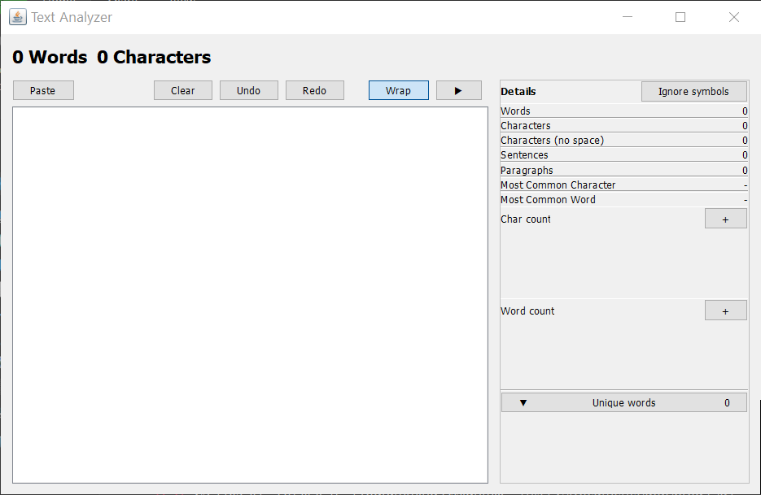
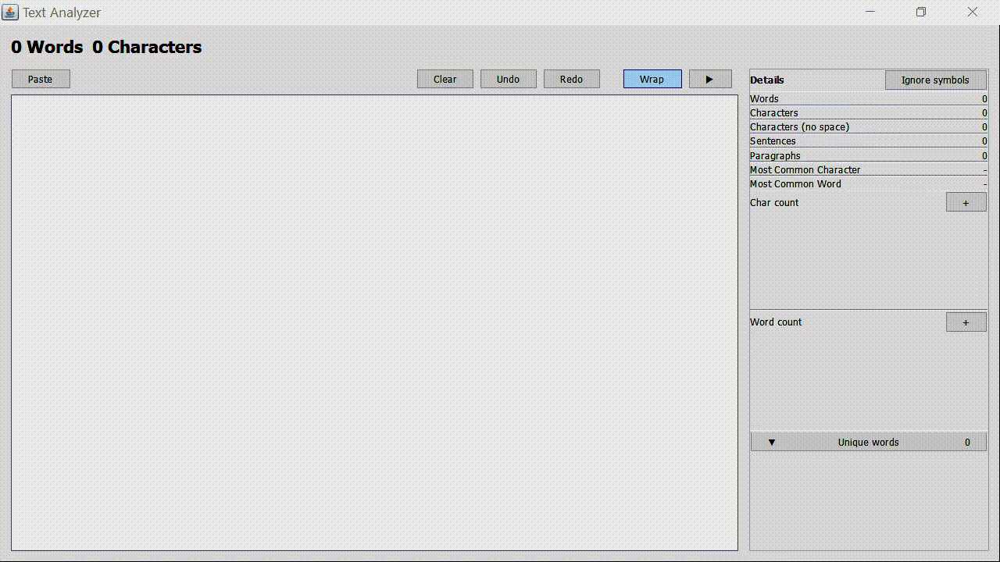

# 🚀 Real-Time Text Analyzer 🚀

**Text Analyzer**, a desktop tool we built with Java Swing.




## 🎬 Live Demo

Walkthrough also available [on YouTube!](https://youtu.be/jnBeJu20LSw) 🎥

[](https://youtu.be/jnBeJu20LSw)


### ✅ Features

*   **User Input:** A spacious and clear text area.
*   **Character & Word Counts:** Instant and accurate.
*   **Most Common Character:** Finds the top character and its count.
*   **Character & Word Frequency:** Lets you track the frequency of any custom character or word.
*   **Unique Word Calculation:** Displays the total count of unique words.

### ✨ Extra Features

*   🖥️ **A Full Graphical Interface (GUI):** Instead of a simple console program, we built a complete visual application using Java Swing.
*   ⚡ **True Real-Time Analysis:** Seriously, *everything* updates as you type. It's fast.
*   🔎 **Most Common Word:** We added the ability to find the most used *word* too, complete with its count.
*   📊 **Advanced Statistics:** You also get live counts for **Sentences**, **Paragraphs**, and **Characters (without spaces)**.
*   📈 **Custom Live Trackers:** Our favorite feature! Add multiple trackers at once to monitor several words or characters as you work.
*   **Smart Toggles:** An "Ignore Symbols" toggle for pure word analysis.
*   📚 **Sorted Unique Word List:** See the full list of unique words, neatly sorted alphabetically with their individual counts.
*   ✍️ **Real Editor Functionality:**
    *   **Undo/Redo** support.
    *   Handy **Paste** and **Clear** buttons.
    *   A **Line Wrapping** toggle for easier reading.
*   💼 **Professional UI/UX:**
    *   A clean, modern, and resizable window.
    *   A **collapsible side panel** to give you more room to write.

## Get It Running 🛠️

### **Option 1: The Easy Way (Recommended)**

1.  Goto [**Releases**](https://github.com/mwdiss/TextAnalyzer/releases) page.
2.  Download the latest `TextAnalyzer.jar` file.
3.  Double-click the file to run! (Requires [Java](https://www.java.com/en/download/) 8 or newer).

### **Option 2: From Source**

To compile it:

1.  Download the [**TextAnalyzer.java file**](https://github.com/mwdiss/TextAnalyzer/blob/release/src/com/TextAnalyzer/TextAnalyzer.java) from the src directory.
2.  Open your terminal and navigate to the `TextAnalyzer.java` file location.
3.  Compile the `.java` file:
    ```sh
    javac TextAnalyzer.java
    ```
4.  Run the application:
    ```sh
    java TextAnalyzer
    ```

## 💻 Built With

*   ☕ **Java**: The heart of the application, powering all the logic.
*   🎨 **Java Swing**: Used for the entire graphical user interface, from the buttons to the text area.
